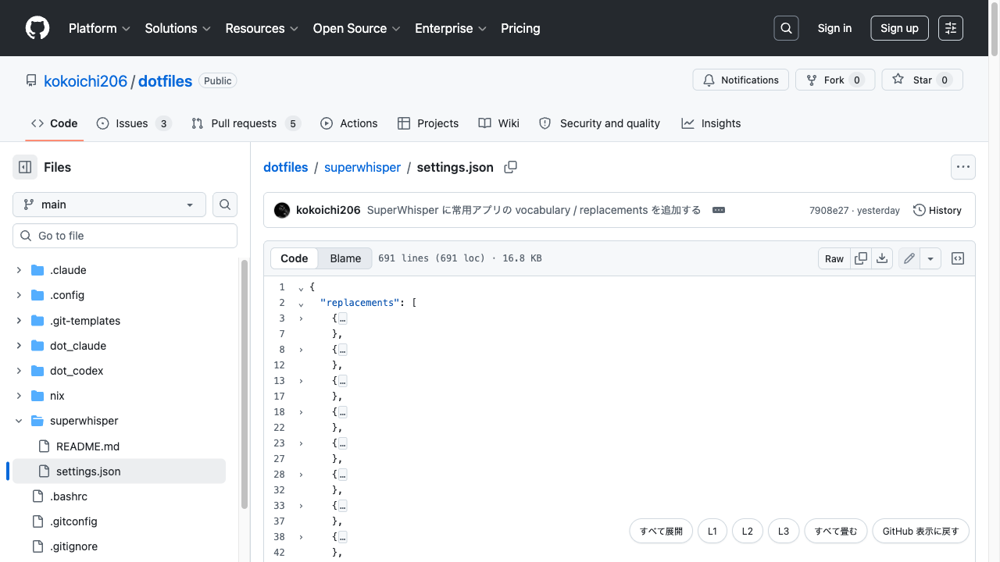
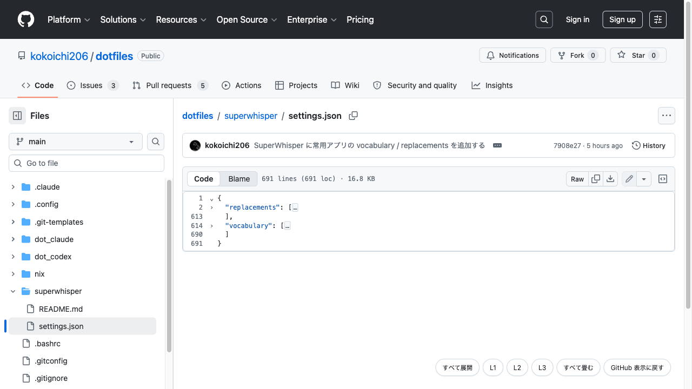
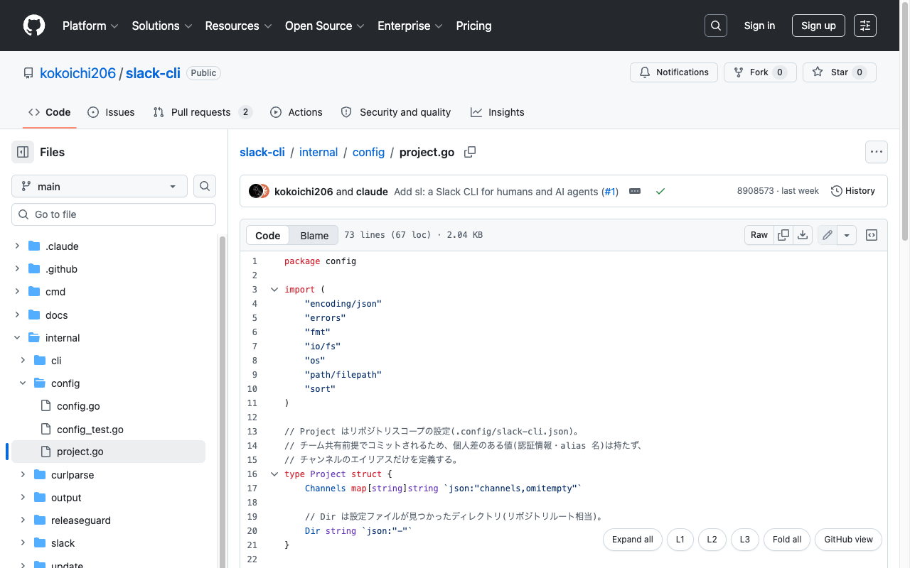
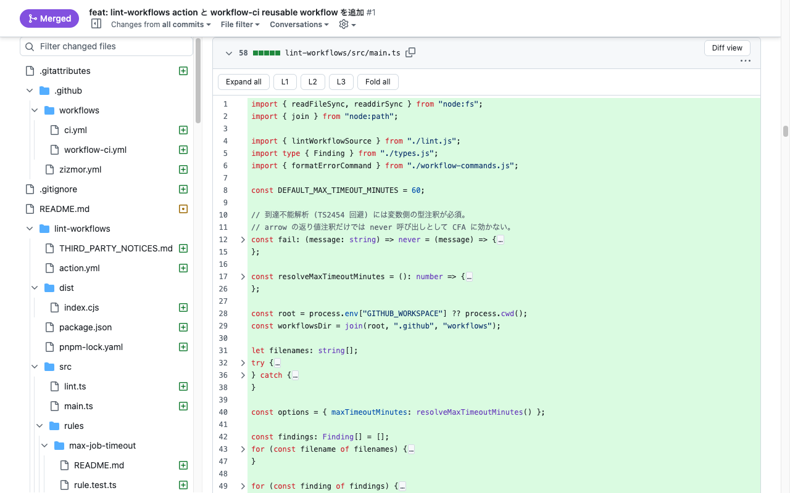

# Foldable View for GitHub

[English](./README.md) | 日本語

GitHub のファイルビューにコード折りたたみを足す拡張。インデントで畳み、指定した深さまで一括で閉じられる。

**[Chrome ウェブストアからインストール](https://chromewebstore.google.com/detail/foldable-view-for-github/kkjejoecddgihebkjgkafmaghopgicoe)**

## なぜ作ったか

GitHub のネイティブ折りたたみはシンボル解析が効く言語に限られ、JSON や YAML の
ような設定・データ系ファイルには何も出ない。効く言語でもセクションを 1 つずつ
クリックして開閉するだけで、ファイル全体を指定の深さまで畳む方法がない。

行を隠す方式の拡張は、GitHub のコードビューが仮想スクロールのため大きいファイルで
壊れる。この拡張は GitHub がページ内に保持している全文を読み、CodeMirror 6 で
描き直す方式を取っている。

## 機能

- インデントで畳むので、Go / Python / YAML / JSON / Markdown など、インデントで
  構造を表す言語であれば同じように動く
- `L1` / `L2` / `L3` でファイル全体を指定の深さまで一括で畳む
- 拡張子からシンタックスハイライトを選ぶ
- GitHub のライト / ダークテーマに追従する
- いつでも GitHub 標準表示に戻せて、その選択を覚える
- PR の diff を、変更行をハイライトした全文表示に切り替えて畳める

## 深さを指定して畳む

`L2` は 2 階層まで開いたまま、`L1` は最外側だけを残して畳む。`Expand all` と
`Fold all` がその両端にあたる。

## インデントする言語ならどれでも

ハイライトは拡張子から、折りたたみはインデントから決まるので、タブインデントの Go も
スペースインデントの YAML も同じように扱える。

## プルリクエスト

diff は断片しか含まないためインデントでは畳めない。Files changed ページでは各ファイルに
`Foldable` ボタンが出て、diff を head 側の全文表示に差し替える。追加行はハイライトされ、
そのまま同じ深さ指定の操作が使える。

## インストール

[Chrome ウェブストアからインストール](https://chromewebstore.google.com/detail/foldable-view-for-github/kkjejoecddgihebkjgkafmaghopgicoe)

自分でビルドして `dist/` を「パッケージ化されていない拡張機能」として読み込む場合は
[DEVELOPMENT.md](./DEVELOPMENT.md) を参照。

## プライバシー

データは一切収集せず、作者にも第三者にも何も送らない。すべてブラウザ内で完結し、
外部ホストのコードを読み込んだり実行したりもしない。詳細は
[プライバシーポリシー](https://kokoichi206.github.io/github-foldable-view-extension/privacy-policy.html)
を参照。

## ライセンス

[MIT](./LICENSE)
